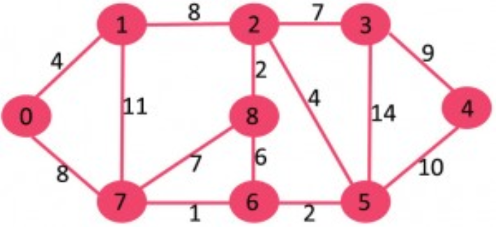
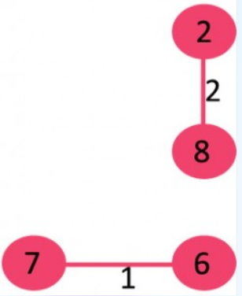
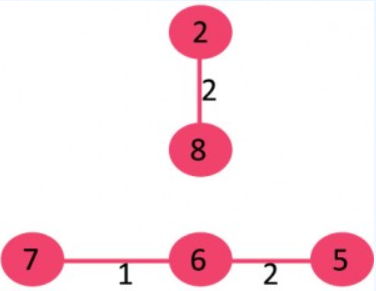
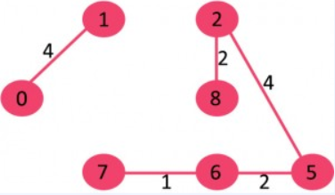
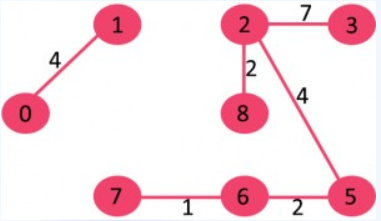
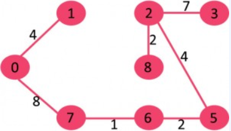
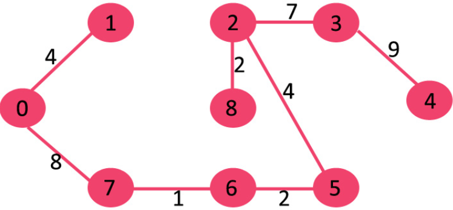

# Visualization-Final-work
This is a homework for SDU's Visualization
我们小组选择展示的是Kruskal算法的可视化展示。团队成员包括韩东廷，牟磊，李云飞，方民炜。

## 关于Kruskal算法

​	对于一个给定的连通的无向图 G = (V, E)，希望找到一个无回路的子集 T，T 是 E 的子集，它连接了所有的顶点，且其权值之和为最小。

$$ w(t)=\sum_{(u,v)\in T}w(u,v)$$

​	因为 T 无回路且连接所有的顶点，所以它必然是一棵树，称为生成树（Spanning Tree），因为它生成了图 G。显然，由于树 T 连接了所有的顶点，所以树 T 有 V - 1 条边。一张图 G 可以有很多棵生成树，而把确定权值最小的树 T 的问题称为最小生成树问题（Minimum Spanning Tree）。术语 "最小生成树" 实际上是 "最小权值生成树" 的缩写。

​	Kruskal 算法提供一种在 O(ElogV) 运行时间确定最小生成树的方案。

​	Kruskal 算法基于贪心算法（Greedy Algorithm）的思想进行设计，其选择的贪心策略就是，每次都选择权重最小的但未形成环路的边加入到生成树中。其算法结构如下：

1. 将所有的边按照权重非递减排序；

2. 选择最小权重的边，判断是否其在当前的生成树中形成了一个环路。如果环路没有形成，则将该边加入树中，否则放弃。

3. 重复步骤 2，直到有 V - 1 条边在生成树中。

## Kruskal算法的寻路步骤

例如，下面是一个无向连通图 G。

图 G 中包含 9 个顶点和 14 条边，所以期待的最小生成树应包含 (9 - 1) = 8 条边。

首先对所有的边按照权重的非递减顺序排序：

| Weight | Src  | Dest |
| ------ | ---- | ---- |
| 1      | 7    | 6    |
| 2      | 8    | 2    |
| 2      | 6    | 5    |
| 4      | 0    | 1    |
| 4      | 2    | 5    |
| 6      | 8    | 6    |
| 7      | 2    | 3    |
| 7      | 7    | 8    |
| 8      | 0    | 7    |
| 8      | 1    | 2    |
| 9      | 3    | 4    |
| 10     | 5    | 4    |
| 11     | 1    | 7    |
| 14     | 3    | 5    |
| 、、、 |      |      |

然后从排序后的列表中选择权重最小的边。

1. 选择边 {7, 6}，无环路形成，包含在生成树中。

2. 选择边 {8, 2}，无环路形成，包含在生成树中。

3. 选择边 {6, 5}，无环路形成，包含在生成树中。

4. 选择边 {0, 1}，无环路形成，包含在生成树中。

5. 选择边 {2, 5}，无环路形成，包含在生成树中。

6.  选择边 {8, 6}，有环路形成，放弃。
7. 选择边 {2, 3}，无环路形成，包含在生成树中。

8. 选择边 {7, 8}，有环路形成，放弃。
9. 选择边 {0, 7}，无环路形成，包含在生成树中。

10.  选择边 {1, 2}，有环路形成，放弃。
11. 选择边 {3, 4}，无环路形成，包含在生成树中。

12.  由于当前生成树中已经包含 V - 1 条边，算法结束

## 我们的实机效果

​	首先，我们给出一个样图，在图上可以直接进行Kruskal算法得到MST，并且在图上进行呈现。点击Kruskal按钮，就会自动选择当前最短的路线，如果没有形成环则将其设置为绿色，表示本条边已经选择，否则不选择。遍历完所有边后，绿色的边组成的树即为MST。

​	此外，通过超链接可以跳转到我们实现的另一个页面上，在这个页面上，用户可以自由的建立一个自己的图，双击可以设置一个点，按下鼠标左键从一点点移动到另一个点再松开左键，就会弹出提示为该无向边设置一个权重。设置完边权后，可以点击Kruskal，即可执行Kruskal搜索MST，当MST生成完毕后即自动停止。同样也提供了refresh和reset功能，refresh可以将所已经搜索过的结果进行清除，便于重新增加想要的点和边，而reset可以将整个界面归零，您可以从头重新构建一个您所需要的图。

